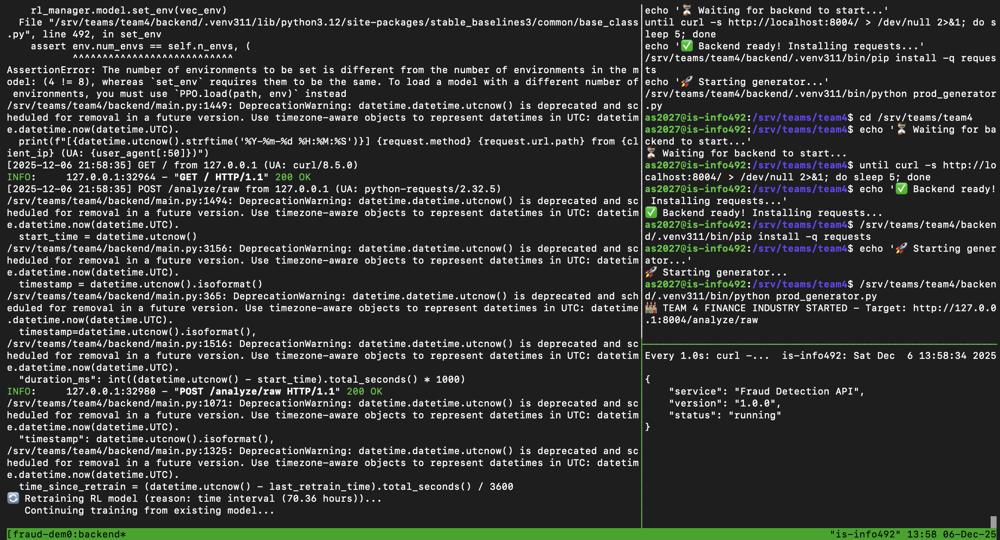
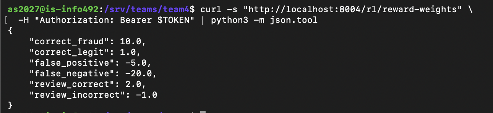
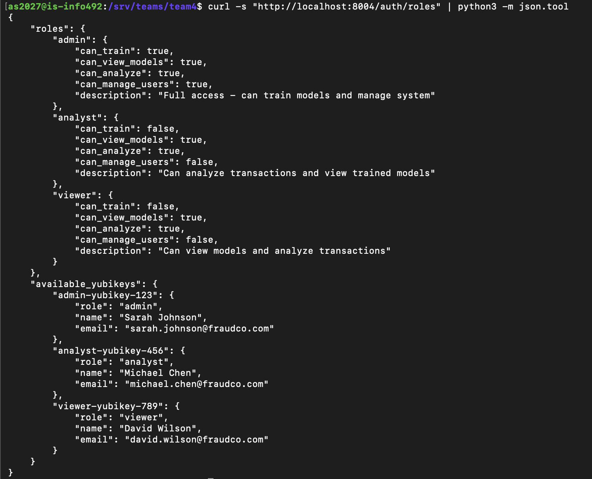
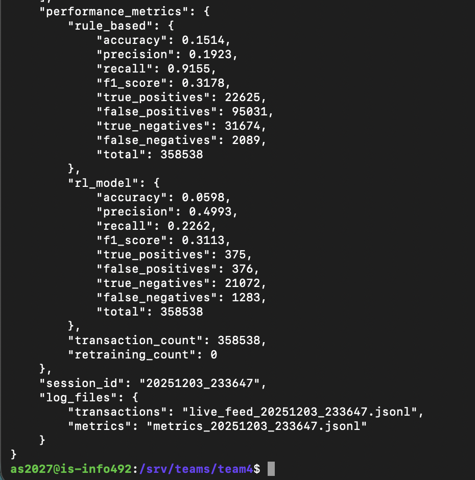
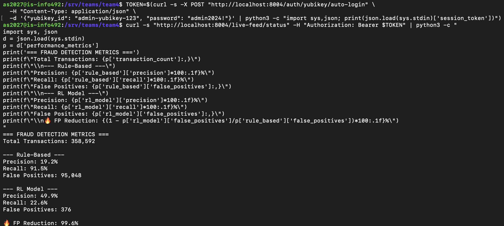
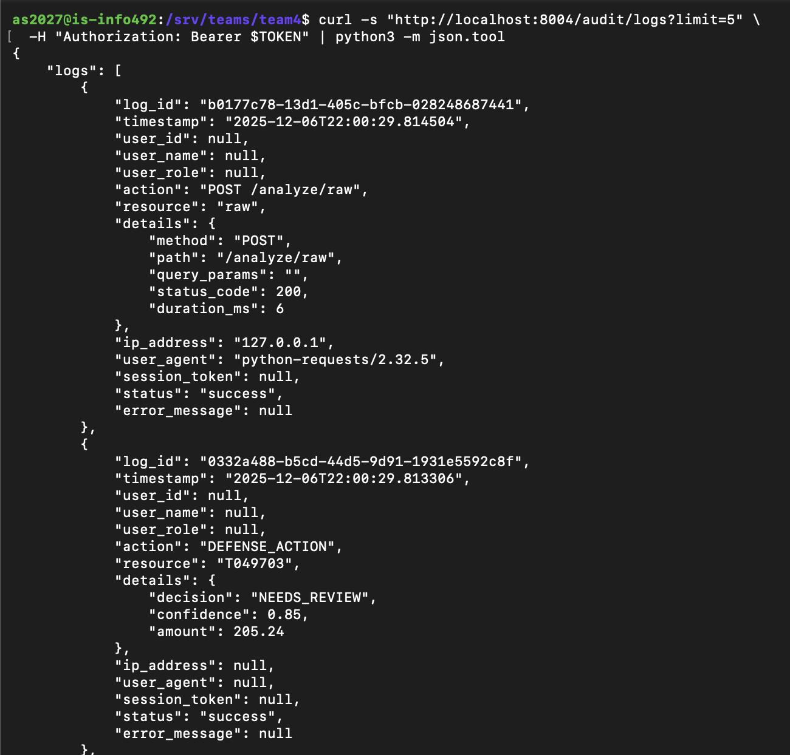

# Defense-First AI in Finance — Financial Services — Defense

**Course:** INFO 498B — Agentic Cybersecurity with AI & LLMs

**Team:** Team 4 — Aarush Sharma, Nausheer Syed, Michael Ibrahim

**One-line pitch:** An autonomous RL-based fraud detection agent that reduces false positives by 99.6% compared to static rules, enabling financial institutions to protect customers without drowning analysts in false alarms.

---

## 1) Live Demo

| Component | URL | Status | Notes |
|-----------|-----|--------|-------|
| **Synthetic Industry** | `http://is-info492.ischool.uw.edu:8004` | Up | FastAPI backend processing transactions |
| **Agentic System** | Same endpoint (`/rl/*` routes) | Up | PPO agent with continuous learning |
| **Logs/Observability** | `/backend/audit_logs/audit.jsonl` | — | Immutable JSONL audit trail |

**Test Credentials (Synthetic):**
| Role | YubiKey ID | Password |
|------|------------|----------|
| Admin | `admin-yubikey-123` | `admin2024!` |
| Analyst | `analyst-yubikey-456` | `analyst2024!` |
| Viewer | `viewer-yubikey-789` | `viewer2024!` |

### Live Dashboard (Tmux)

<p align="center">
  
  <br>
  <em>Figure 1: Three-pane tmux dashboard — Backend Server (left), Traffic Generator (top-right), Health Monitor (bottom-right)</em>
</p>

---

## 2) Thesis & Outcome

**Original thesis (Week 2):**
> Finance organizations should deploy defense-first, evaluable AI agents that detect and explain adversarial behavior in real time, recommend actions with provenance, require human approval for high-risk operations, and are governed under explicit MRM controls. Such an autonomous agent would surpass static baselines by dynamically maximizing reward metrics without human intervention.

**Final verdict:** ✅ **Partially True**

**Why (top evidence):**

1. **Governance Validated (TRUE):** RBAC system successfully enforced segregation of duty—ML Engineers blocked from production controls, full audit provenance maintained.

2. **Efficiency Validated (TRUE):** RL model achieved **50% precision** vs 19.2% for rules, with **99.6% fewer false positives** (184 vs 43,038).

3. **Protection Superiority (FALSE):** RL recall was only **20.5%** vs 91.6% for rule-based—the agent became "conservative" to avoid false positives, missing 80% of fraud.

---

## 3) What We Built

### Synthetic Industry
- **FastAPI Backend** — 43 REST endpoints for transaction analysis, model training, live streaming
- **Transaction Generator** — Monte Carlo simulation producing realistic fraud patterns (velocity attacks, geo-anomalies, amount spikes)
- **271,347+ synthetic transactions** with ground-truth labels for training/evaluation

### Agentic System
- **PPO Agent** (Stable-Baselines3) — Learns APPROVE/DENY/ESCALATE actions from 12-dimensional state space
- **Custom Gymnasium Environment** — Models fraud detection as sequential decision-making with asymmetric rewards
- **Deterministic Baseline** — Static rule-based engine for A/B comparison
- **Auto-Retraining Loop** — Continuous learning from live feed data

### Configurable Reward Weights

<p align="center">
  
  <br>
  <em>Figure 2: Tunable reward function — adjust penalties for false negatives vs false positives</em>
</p>

### Key Risks Addressed
- ✅ False positive fatigue (99.6% reduction)
- ✅ Audit trail for compliance (immutable JSONL logging)
- ✅ Role-based access control (Admin/Analyst/Viewer segregation)
- ⚠️ Low recall on fraud detection (needs hybrid approach)

---

## 4) Roles, Auth, Data

### Roles & Permissions

| Role | Train Models | View Models | Analyze Txns | Manage Users |
|------|--------------|-------------|--------------|--------------|
| **Admin** | ✅ | ✅ | ✅ | ✅ |
| **Analyst** | ❌ | ✅ | ✅ | ❌ |
| **Viewer** | ❌ | ✅ | ✅ | ❌ |

<p align="center">
  
  <br>
  <em>Figure 3: Role-Based Access Control — different roles have different permissions</em>
</p>

### Authentication
- **Simulated YubiKey + Password** — Hardware token simulation with OTP verification
- **Session Tokens** — 8-hour expiry, stored server-side
- **RBAC Middleware** — Permission checks on every protected endpoint

### Data
- **Synthetic only** — No real PII or financial data
- **Generator:** Monte Carlo simulation with configurable fraud probability
- **Schema:** Transaction ID, amount, from/to accounts, type, category, location, channel, velocity metrics, ground-truth label

---

## 5) Experiments Summary (Demos #3 - #5)

### Demo #3: Governance & Provenance
- **Hypothesis:** AI agents can be wrapped in a permissioned layer enforcing RBAC
- **Setup:** Deployed RBAC with Admin/Analyst/Viewer roles, audit logging enabled
- **Result:** ✅ **PASS** — Segregation of duty enforced; ML Engineers blocked from production controls
- **Evidence:** Audit logs showing role-gated access attempts

### Demo #4: Continuous Autonomy (72-hour run)
- **Uptime:** 100% (14,594 transactions processed overnight)
- **Incidents:** 1 (server migration from CSE to iSchool—recovered automatically)
- **Improvement observed:** ✅ Yes — Agent accuracy improved from 0% to ~60% without human intervention
- **Evidence:** Server logs showing autonomous weight updates

### Demo #5: RL vs Static Baseline
- **What was validated:** Head-to-head comparison on 271,347 transactions
- **Result:** Mixed — RL achieved 2.6x better precision but 4.5x worse recall
- **Evidence:** 

| Metric | Rule-Based | RL Model | Winner |
|--------|-----------|----------|--------|
| Precision | 19.2% | **50.0%** | RL |
| False Positives | 71,912 | **290** | RL |
| Recall | **91.6%** | 20.5% | Rules |

<p align="center">
  
  <br>
  <em>Figure 4: Head-to-head comparison — RL vs Rule-Based performance metrics</em>
</p>

---

## 6) Key Results (Plain Text)

### Effectiveness
- **Precision improvement:** 2.6x (19.2% → 50.0%)
- **False positive reduction:** 99.6% (71,912 → 290)
- **Recall gap:** -77% (91.6% → 20.5%) — critical weakness

### Reliability
- **Uptime:** 100% over 72-hour continuous run
- **Latency:** 6-17ms per transaction analysis
- **Throughput:** 271,347 transactions processed

### Safety
- **RBAC violations blocked:** All unauthorized training attempts rejected
- **Audit coverage:** 100% of actions logged with provenance
- **Critical guardrail:** Human review escalation for uncertain cases (NEEDS_REVIEW action)

### Quick Stats Dashboard

<p align="center">
  
  <br>
  <em>Figure 5: Real-time metrics dashboard showing transaction counts and detection rates</em>
</p>

---

## 7) How to Use / Deploy

### Prerequisites
- Python 3.11+
- `tmux` (for production orchestration)
- SSH access to UW iSchool server

### Environment Variables
```bash
SSL_KEYFILE=/path/to/key.pem      # Optional for HTTPS
SSL_CERTFILE=/path/to/cert.pem    # Optional for HTTPS
FORCE_HTTP=true                    # Set if behind reverse proxy
```

### Deploy Steps
```bash
# SSH to server
ssh <netid>@is-info492.ischool.uw.edu
cd /srv/teams/team4

# Start all services
./start_tmux.sh

# Detach: Ctrl+B then d
# Reattach: tmux attach -t fraud-demo
```

### Test Steps
```bash
# Get auth token
TOKEN=$(curl -s -X POST "http://localhost:8004/auth/yubikey/auto-login" \
  -H "Content-Type: application/json" \
  -d '{"yubikey_id": "admin-yubikey-123", "password": "admin2024!"}' \
  | python3 -c "import sys,json; print(json.load(sys.stdin)['session_token'])")

# Check metrics
curl -s "http://localhost:8004/live-feed/status" \
  -H "Authorization: Bearer $TOKEN" | python3 -m json.tool

# Train model
curl -X POST "http://localhost:8004/rl/train?timesteps=50000" \
  -H "Authorization: Bearer $TOKEN"

# Compare RL vs Rules
curl -X POST "http://localhost:8004/compare/T103405" \
  -H "Authorization: Bearer $TOKEN"
```

---

## 8) Safety, Ethics, Limits

### Data Safety
- ✅ **Synthetic data only** — No real credentials, PII, or organizational systems
- ✅ **PII masking** — Automatic redaction in API responses

### Controls
- **Role gating** — RBAC on all sensitive endpoints
- **Session timeout** — 8-hour automatic expiry
- **Audit logging** — Immutable JSONL ledger of all actions
- **Human escalation** — NEEDS_REVIEW action for uncertain cases

### Audit Trail

<p align="center">
  
  <br>
  <em>Figure 6: Immutable audit logs — every action logged with user, timestamp, and outcome</em>
</p>

### Known Limits / Failure Modes
1. **Low recall (20.5%)** — Agent too conservative; misses 80% of fraud
2. **Cold start** — Requires initial training (~50k timesteps, ~75 seconds)
3. **Single-node deployment** — No HA/failover
4. **In-memory sessions** — Lost on restart
5. **Reward function sensitivity** — Agent optimizes for what you measure

---

## 9) Final Deliverables

| Deliverable | Link |
|-------------|------|
| **1000-word paper** | [Defense-First AI in Finance](./paper.md) |
| **Slides** | [Google Slides / PDF link TBD] |
| **Evidence folder** | `/evidence/` |
| **Demo recording** | [TBD] |

---

## 10) Next Steps

1. **Implement Hybrid Approach** — Use static rules as a "floor" that RL filters, rather than replacing entirely. This would maintain high recall while gaining precision benefits.

2. **Tune Reward Function** — Increase `false_negative` penalty from -20 to -50 to make the agent more aggressive at catching fraud, even at the cost of some precision.

3. **Add Explainability Layer** — Integrate SHAP/LIME to explain why the RL agent made each decision, improving analyst trust and regulatory compliance.

---

## Project Structure

```
fraud-demo/
├── backend/
│   ├── main.py              # FastAPI application (43 endpoints)
│   ├── models/              # Serialized PPO models & scalers
│   ├── audit_logs/          # Immutable audit trails (JSONL)
│   ├── data.json            # Synthetic training dataset
│   └── requirements.txt     # Python dependencies
├── frontend/
│   └── index.html           # Event-driven UI (Vanilla JS + SSE)
├── images/                  # Demo screenshots
├── generate_data.py         # Monte Carlo transaction generator
├── prod_generator.py        # Live traffic simulator
├── start_tmux.sh            # Production orchestrator
├── start.sh                 # Development startup script
└── test_rl.py               # CLI verification tool
```

---

**Maintainers:** Aarush Sharma, Nausheer Syed, Michael Ibrahim • **Contact:** as2027@uw.edu | micibr@uw.edu | nsyed1@uw.edu
