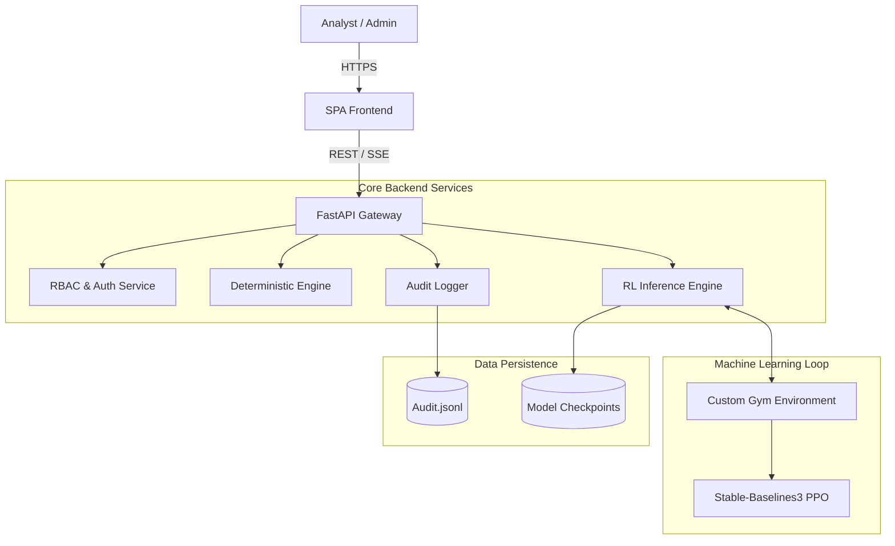

# Fraud Detection Co-Pilot: From Static Rules to Adaptive RL

## Abstract

This project demonstrates the architectural evolution of fraud detection systems, moving from deterministic, rule-based logic to adaptive **Reinforcement Learning (RL)** agents. It serves as a technical proof-of-concept for **Human-AI Collaboration** in high-stakes financial environments, emphasizing **safety**, **governance**, and **explainability** over pure algorithmic performance.

---

## 🧠 Design Philosophy & Ideology

### The Core Hypothesis
Traditional fraud detection relies on static "if-then" rules (e.g., *if amount > $10,000, flag for review*). While interpretable, these systems are:
1.  **Rigid**: They fail to adapt to shifting fraud patterns without manual intervention.
2.  **Binary**: They struggle to capture nuanced, non-linear relationships between features.

Our hypothesis is that a **Proximal Policy Optimization (PPO)** agent, treating fraud detection as a cost-sensitive game, can outperform static baselines by learning to maximize long-term business value rather than just minimizing immediate error rates.

### Safety First: The Governance Layer
In financial systems, "accuracy" is insufficient; the system must be "safe." We define safety through three pillars implemented in this architecture:
1.  **Role-Based Access Control (RBAC)**: Enforcing least-privilege access (Viewer vs. Analyst vs. Admin) via simulated hardware tokens (YubiKey).
2.  **Immutable Audit Trails**: Every decision, login, and model training event is cryptographically logged to a JSONL ledger, ensuring full decision provenance.
3.  **Privacy by Design**: All API responses automatically mask Personally Identifiable Information (PII) before leaving the secure boundary.

---

## 🏗 Technical Architecture

The system mimics a modern microservices architecture, composed of a high-performance backend, an event-driven frontend, and a specialized ML training loop.



### 1. The Adaptive Engine (RL)
Instead of supervised classification, we model fraud detection as a sequential decision-making process using **Gymnasium**:
*   **State Space**: 12-dimensional vector (normalized transaction amount, velocity, geo-risk, channel risk, etc.).
*   **Action Space**: Discrete actions: `APPROVE`, `DENY`, `ESCALATE`.
*   **Reward Function**: asymmetric cost function where False Negatives (missing fraud) are penalized 4x more heavily than False Positives, reflecting real-world risk appetite.

### 2. The Deterministic Engine (Baseline)
A "control" system implementing standard industry logic:
*   Velocity checks (transactions per minute).
*   Geographic anomalies (distance from home location).
*   Amount thresholds based on historical averages.

### 3. The Backend (FastAPI)
Built on **FastAPI** for high concurrency:
*   **Server-Sent Events (SSE)**: used for the live transaction feed to push updates to the client without polling.
*   **Middleware Chains**: Custom middleware handles request ID generation, PII masking, and audit logging transparently for every request.

---

## ⚙️ Infrastructure & Deployment

The system is designed for resilience and observability, deployed on the University of Washington's **Attu** infrastructure.

### Production Orchestration (TMUX)
To ensure high availability without container orchestration overhead, we utilize a `tmux` based process manager (`start_tmux.sh`) that maintains three persistent contexts:

1.  **API Gateway**: The main uvicorn process handling HTTP/S traffic.
2.  **Traffic Generator**: A background daemon (`prod_generator.py`) that simulates realistic user behavior and fraud attacks (bursts, trickling).
3.  **Health Monitor**: A real-time `curl` loop verifying API health and latency.

### UW Server Integration
The application (`main.py`) contains environment-aware logic for the UW CSE environment:
*   **SSL/TLS Autoconfiguration**: Automatically detects valid certificates in standard UW directories (`/homes/iws/...`) to enable secure HTTPS.
*   **Reverse Proxy Compatibility**: Handles `X-Forwarded-For` headers correctly when deployed behind Nginx ingress controllers.

---

## 📂 Project Structure

```
fraud-demo/
├── backend/
│   ├── main.py              # Core FastAPI application & logic
│   ├── models/              # Serialized PPO models & scalers
│   ├── audit_logs/          # Immutable audit trails
│   ├── data.json            # Synthetic training dataset
│   └── requirements.txt     # Python dependencies
├── frontend/
│   └── index.html           # Event-driven UI (Vanilla JS)
├── generate_data.py         # Monte Carlo simulation for transaction data
├── start_tmux.sh            # Production process orchestrator
└── test_rl.py               # CLI verification tool for RL agents
```
